# Rota Segura

**Contexto e Descrição do Projeto:**

Você já ficou na dúvida entre sair de casa ou não quando está chovendo muito, porque os jornais dizem que a cidade está **inteira alagada**? 
E se eu te dissesse que a partir de agora você pode sair com muito mais **confiança de casa nesses cenários**? Seria ótimo, né? 
Então foi pensando nisso que desenvolvemos o app Rota Segura, que é um aplicativo focado em informações reais de usuários para usuários. 

**Rota Segura** é um app que conecta pessoas durante situações de risco, como enchentes e alagamentos, promovendo uma rede de apoio baseada em localização. 
Ele oferece um **feed colaborativo** onde usuários compartilham fotos e relatos do que está realmente acontecendo em cada região, ajudando outros a tomarem decisões seguras sobre se devem sair de casa ou não.

Além disso, o app conta com:

- **Mapa interativo** com pontos de alagamento atualizados em tempo real via sensores IoT.
- **Botão SOS** que compartilha automaticamente a localização de quem precisa de ajuda.
- **Busca por abrigos** próximos para quem está em situação de risco.
- **Voluntariado:** você pode se registrar como voluntário ou buscar ajuda próxima.

---

## Tecnologias Utilizadas

- Java 17: Linguagem principal da API
- Spring Boot: Framework para criação da API REST
- JPA + Hibernate: Persistência de dados com relacionamento entre entidades
- Oracle Database: Banco de dados relacional
- Docker: Deploy da aplicação em containers
- Render: Plataforma de deploy na nuvem
- Bean Validation: Para as requests
- Swagger: Documentação da API

## Configuração do Projeto

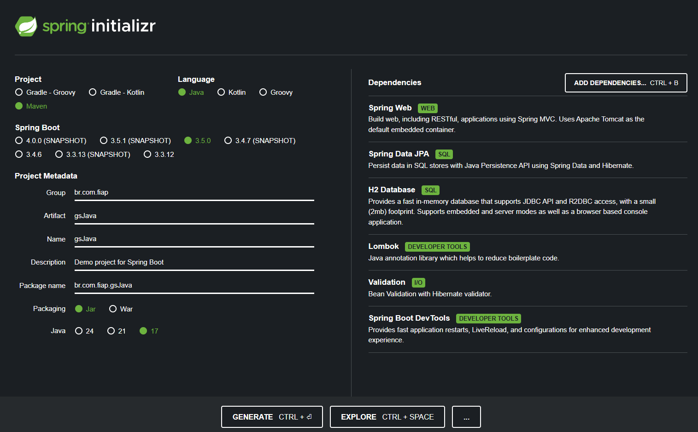

**Dependências:**
- Spring Web: Por se tratar de uma API Rest;
- Spring Data JPA: Acessar e manipular bancos de dados;
- Oracle Drive: Banco de dados Oracle;
- Lombok: Gerar automaticamente códigos repetitivos (mais otimizado);
- Validation: Validações com Bean Validation usadas nos DTOs.
- Spring Boot DevTools: Recursos que ajudam na produtividade;

---

## Estrutura do Banco de Dados:


**Entidades:** Selo, Usuario, Publicacao, Emergencia, Local

- Selo (1) ↔ (N) Usuario:
Um selo pode ser de vários usuários.
Cada usuário possui a um único selo.

- Usuario (1) ↔ (N) Publicacao:
Uma usuario pode fazer várias publicações.
Cada publicação é feita por um usuário.

- Usuario (1) ↔ (N) Emergencia:
Uma usuario pode ter vários registros de emergência.
Cada emergência está associado a um única usuário.

- Local (1) ↔ (N) Emergencia:
Em um local pode haver várias emergências.
Cada emergência acontece em um único local.

---

## Deploy da API

- Acesse o link abaixo e coloque o endpoint no final: 
`https://java-gs1-v1.onrender.com/` 

- Documentação no **Swagger**:
`https://java-gs1-v1.onrender.com/swagger-ui/index.html`

---

## Endpoints

**1. Selo:**

| Método | URI           | Descrição                     |
| ------ | ------------- | -----------------------------|
| GET    | `/selos`      | Lista todos os selos          |
| GET    | `/selos/{id}` | Busca um selo pelo ID         |
| POST   | `/selos`      | Cria um novo selo             |
| PUT    | `/selos/{id}` | Atualiza um selo existente    |
| DELETE | `/selos/{id}` | Deleta um selo pelo ID        |


**2. Usuario:**

| Método | URI            | Descrição                    |
| ------ | -------------- | ----------------------------|
| GET    | `/usuarios`    | Lista todos os usuários      |
| GET    | `/usuarios/{id}` | Busca um usuário pelo ID     |
| POST   | `/usuarios`    | Cria um novo usuário         |
| PUT    | `/usuarios/{id}` | Atualiza um usuário existente|
| DELETE | `/usuarios/{id}` | Deleta um usuário pelo ID    |


**3. Publicacao:**

| Método | URI                  | Descrição                                                                              |
|--------|----------------------|----------------------------------------------------------------------------------------|
| GET    | `/publicacoes`       | Lista todas as publicações                                                            |
| GET    | `/publicacoes?status=true/false` | Lista publicações filtrando por status (ativas/inativas)                          |
| GET    | `/publicacoes/{id}`  | Busca uma publicação pelo ID                                                          |
| POST   | `/publicacoes`       | Cria uma nova publicação                                                               |
| PUT    | `/publicacoes/{id}`  | Atualiza os dados de uma publicação existente                                          |
| DELETE | `/publicacoes/{id}`  | Deleta uma publicação pelo ID                                                         |


**4. Emergencia:**

| Método | URI                   | Descrição                                                         |
| ------ | --------------------- | ----------------------------------------------------------------- |
| GET    | `/emergencias`        | Lista todas as emergências registradas                           |
| GET    | `/emergencias/{id}`   | Busca uma emergência pelo ID                                     |
| POST   | `/emergencias`        | Cria uma nova emergência                                         |
| PUT    | `/emergencias/{id}`   | Atualiza os dados de uma emergência existente                    |
| DELETE | `/emergencias/{id}`   | Deleta uma emergência pelo ID                                    |


**5. Local:**

| Método | URI               | Descrição                                                                 |
|--------|-------------------|---------------------------------------------------------------------------|
| GET    | `/locais`         | Lista todos os locais                                                     |
| GET    | `/locais?status=true/false` | Lista locais filtrando por status (ativos/inativos)                          |
| GET    | `/locais/{id}`    | Busca um local pelo ID                                                   |
| POST   | `/locais`         | Cria um novo local                                                       |
| PUT    | `/locais/{id}`    | Atualiza os dados de um local existente                                  |
| DELETE | `/locais/{id}`    | Deleta um local pelo ID                                                  |

---

## Exemplos de Requisições

Acesse a Collection do Postman com as requisições já monstadas: 
``https://www.postman.com/altimetry-astronaut-50480178/workspace/my-workspace/collection/38977802-878a9f7b-aa5b-4428-9741-087efee62630?action=share&creator=38977802``

Ou faça os testes direto pelo Swagger: 
`https://java-gs1-v1.onrender.com/swagger-ui/index.html`


- Exemplo de Request **Selo**:
````json
{
    "descricao": "lendário"
}
````

- Exemplo de Request **Usuario**:
````json
{
    "nome": "Raquel",
    "email": "raquel@gmail.com",
    "senha": "111",
    "cidade": "Vitoria",
    "estado": "Espirito Santo",
    "telefone": "11990007777",
    "seloId": 3
}
````

- Exemplo de Request **Publicacao**:
````json
{
    "titulo": "Chava forte na Av. Paulista",
    "descricao": "A avenida está completamente alagada. Evitem passar por lá.",
    "imagem": "https://exemplo.com/imagem4.jpg",
    "cidade": "Campinas",
    "estado": "São Paulo",
    "votosConfiavel": 15,
    "votosFalso": 2,
    "usuario": {
        "id": 4
    }
}
````

- Exemplo de Request **Local**:
````json
{
    "rua": "Rua dos Apaixonados",
    "numero": 80,
    "cidade": "Sorocaba",
    "estado": "São Paulo",
    "evento": "EMERGENCIA"
}
````

- Exemplo de Request **Emergencia**:
````json
{
    "mensagem": "Preciso de um bote para usar na enchente.",
    "usuario": {
        "id": 1
    },
    "local": {
        "id": 3
    }
}
````

---

## Regras de Negócio

1. Ao criar uma publicação, a data e o status dela são definidos para a data atual e TRUE, respectivamente;

2. Não é possível editar data, status e usuário que fez a publicação;

3. Ao deletar uma publicação, seu status é alterado para ‘false’, não há exclusão de fato (assim como ocorre em grandes redes sociais). Essa publicação não poderá ser alterada ou listada novamente. Para exemplificar, foi implementado um endpoint que lista apenas as publicações “excluídas”;

4. Ao criar uma ‘Emergencia’ é necessário informar qual ‘Usuario’ e ‘Local’ que estão associados a ela. E no PUT só é possível alterar a ‘mensagem’, pois data, status, usuario e local são definidos somente com a criação da ‘Emergencia’;

5. O ID do local deve ter o atributo 'evento' do tipo EMERGENCIA;

6. Não é possível deletar um Selo que está sendo usado por usuários;

7. Ao excluir um Usuario, suas publicações e emergências também serão excluídas;

8. Se deletar um Local, alguns dados permanecerão em Emergencia (pois não há exclusão de fato no Local, pois futuramente alguém pode querer analisar as áreas de mais alagamento. Então, ao invés de excluir o Local, o seu status é alterado para ‘false’), porém não será possível criar uma Emergencia num Local deletado.

---

## Tratamento de Exceções

Foram criadas classes de tratamento de exceções, responsáveis por receber e montar montar uma mensagem de erro amigável em casos de responses ``404`` (Not Found), ``400`` (Bad Request) etc.

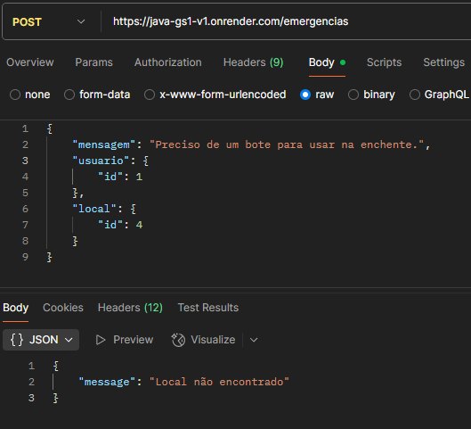

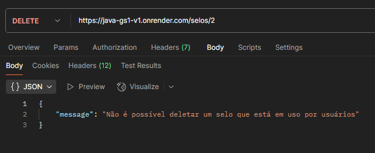

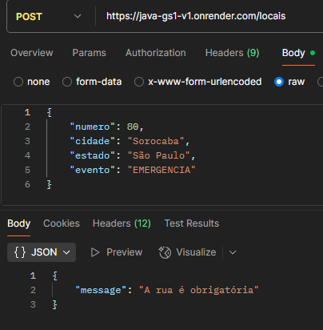

---

## Instruções para Executar o Projeto (JAVA ADVANCED)

Para testar localmente:
1. Faça o clone desse repositório: ```git clone https://github.com/eduardogdias/java_gs1.git```;
2. Tenha pelo menos o Java 17 (o projeto foi desenvolvido usando essa versão);
3. Abra ele em sua IDE de preferência;
4. Dê um Run na classe "GsJavaApplication";
5. Teste as requisições no Postman/Insomnia ou pelo Swagger.

Para testar pelo Deploy:
- No Postman/Insomnia use o link a seguir e coloque os endpoints no final dele: 
`https://java-gs1-v1.onrender.com` 

- Ou faça os testes direto pelo Swagger:
`https://java-gs1-v1.onrender.com/swagger-ui/index.html`


---

## Visão Geral do Projeto

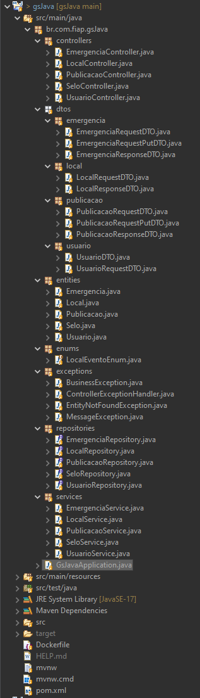

---

## Instruções para Executar o Projeto (DEVOPS TOOLS And CLOUD COMPUTING)

**1.** No Azure CLI, vamos criar e configurar nossa VM. Digite esses 3 comandos no terminal:
````sh
git clone https://github.com/eduardogdias/devops_gs1.git

chmod 744 devops_gs1/criar-vm-linux-gs.sh

./devops_gs1/criar-vm-linux-gs.sh 
````
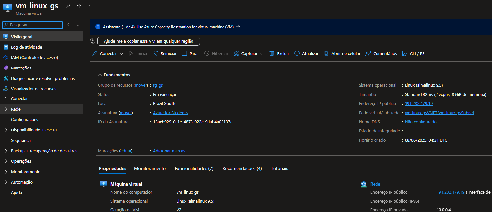


**2.** Faça uma conexão SSH com sua VM, digite 'yes' para confiar, e coloque sua senha após isso:
````sh
ssh admlnx@IpVM
````

**3.** O Git, Nano e Docker já vieram instalados e configurados pelo script de criação da VM:

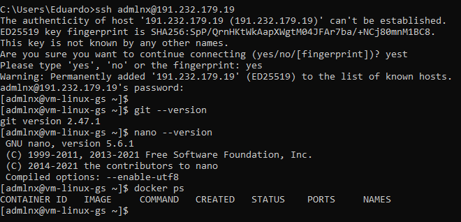

**4.** Crie a rede para agrupar os dois containers que serão usados:
````sh
docker network create network-gs
````

**5.** Clone o projeto dentro da VM:
````sh
git clone https://github.com/eduardogdias/devops_gs1.git

cd devops_gs1
````

**6.** Veja que há dois Dockerfiles no projeto, que serão usados em cada um dos containers. Um com o container do Oracle, e outro com o container que vai rodar a API Java. 

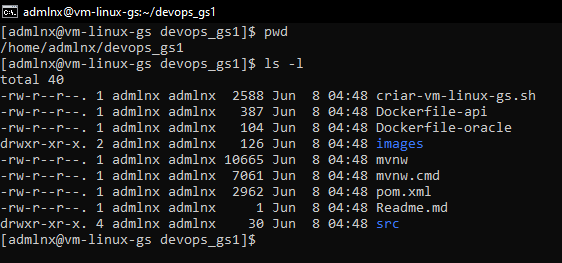

Vamos "buildar" essas imagens:
````sh
docker build -f Dockerfile-oracle -t img-oracle .
````
Obs: passe o nome do JAR pela variável de ambiente no momento de criação da imagem:
````sh
docker build -f Dockerfile-api --build-arg NOME_JAR=gsJava -t img-api .
````

**7.** Agora, crie os dois container usando as imagens "buildadas":
- Container com Oracle
````sh
docker run -d \
  --name container-oracle \
  --network network-gs \
  -p 1521:1521 \
  -e ORACLE_PWD="Fiap@2tdspv2025" \
  -v volume-oracle:/opt/oracle/oradata \
  img-oracle
````

Veja o volume criado:
````sh
docker volume ls
````

Verifique o log do container (ele tem que estar 'DATABASE IS READY TO USE!'):
````sh
docker logs -f container-oracle
````

- Container com a API Java

São passados o nome e senha do banco de forma dinâmica que serão usados para fazer a conexão no application.properties do projeto:
````sh
docker run -d \
  --name container-api \
  --network network-gs \
  -p 8080:8080 \
  -e CONTAINER_BANCO_NOME=container-oracle \
  -e CONTAINER_BANCO_SENHA=Fiap@2tdspv2025 \
  img-api
````

Veja o log do container (será mostrado o log do projeto spring):
````sh
docker logs -f container-api
````

----


A partir da execução dos códigos acima, já é possível acessar a API (via Postman, por exemplo) utilizando o IP da VM e a porta 8080.

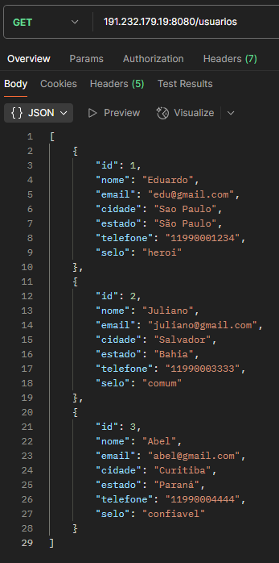

Também é possível acessar o Oracle pelo SQL Developer informando: o usuário "SYSTEM", a senha, IP da VM e XEPDB1 como sendo o nome do serviço.
E já será possível visualizar as tabelas criadas pela API.

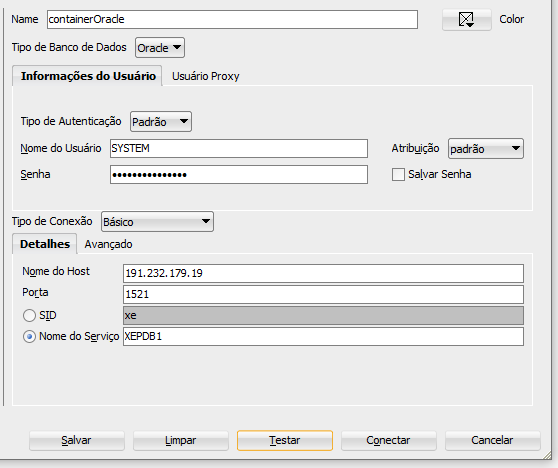
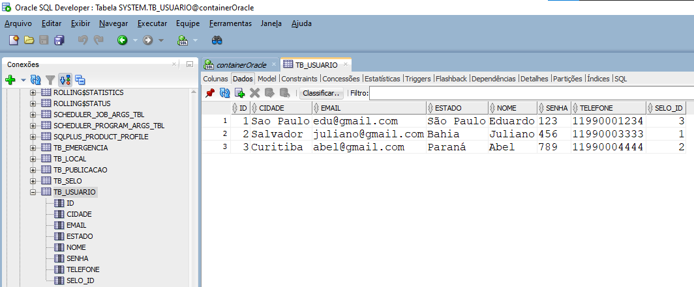

---

## Listando

**docker image ls**

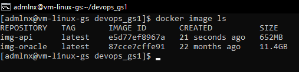

**docker ps -a**

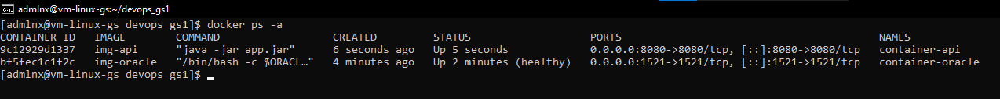

**docker volume ls**

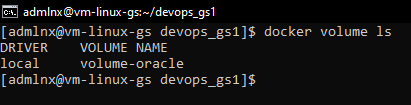

**docker network ls**

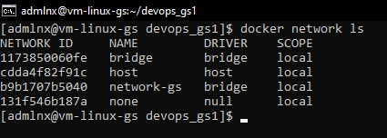

---

## Excluindo a VM:

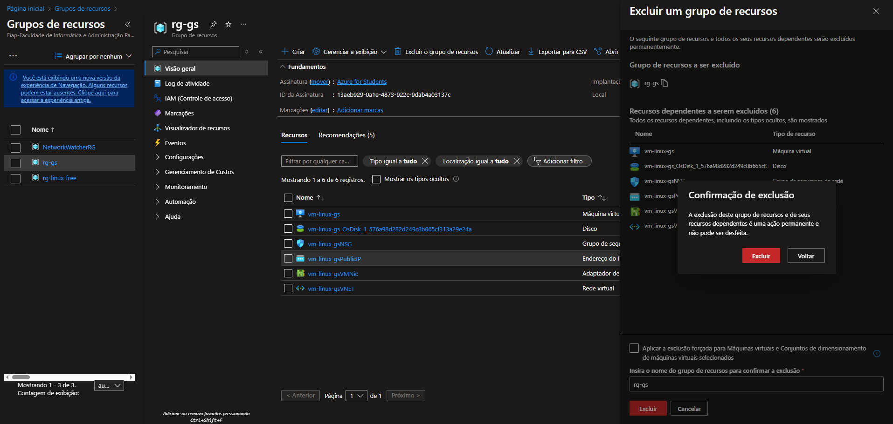

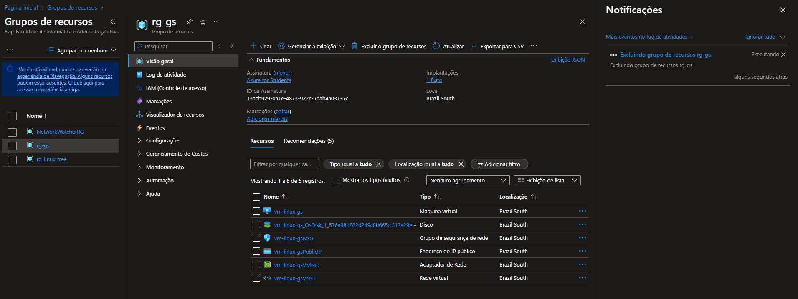

